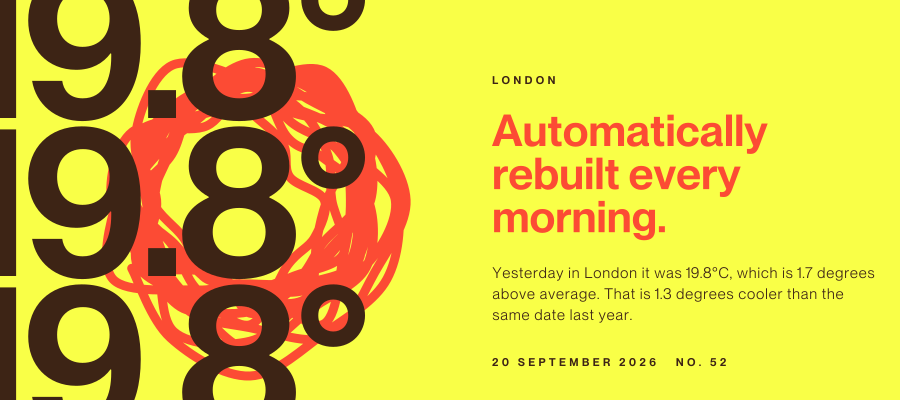
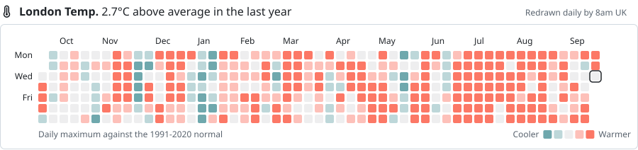
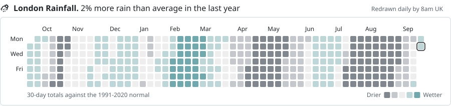
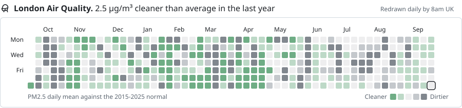
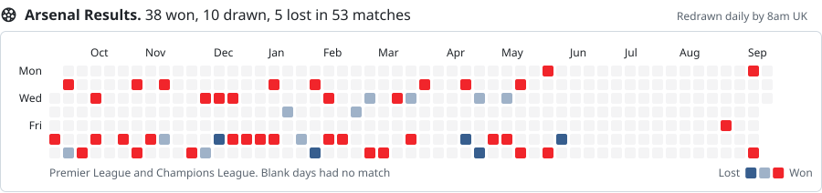
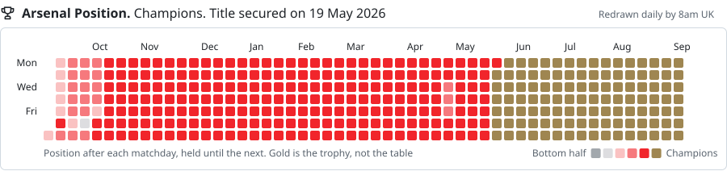
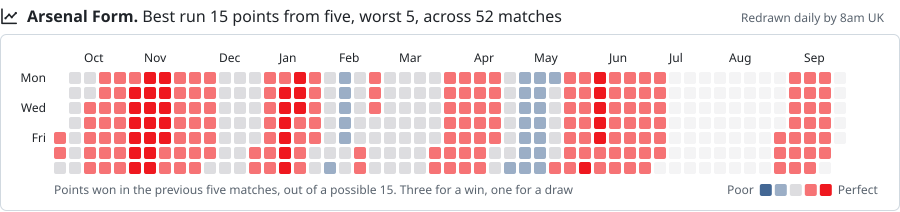

**A software engineer with roots in research, design and creative technology.**

Most recently at Amazon, building applied-AI and real-time products from prototype through to production.

Recent work:

- Real-time AI translation serving 3M+ translations across 30+ languages, including 17 with no coverage from traditional translation providers
- A triple-validation framework for measuring AI quality rather than trusting it: human evaluation, BLEU scoring and multi-model adversarial testing, with a 96% error detection rate
- Live multi-device experiences spanning browser audio capture, streaming transcription and synchronised interfaces
- Named inventor on a granted US patent

Currently exploring practical AI evaluation, agent workflows, and expressive interfaces that remain reliable in production.

More at [jonsut.co.uk](https://jonsut.co.uk) · [LinkedIn](https://www.linkedin.com/in/jon-sutton-b11251147)

   

## Contribution graphs for things that aren't contributions

GitHub's contribution graph is a decent piece of information design doing exactly one
job. This is an experiment in pointing it at other things: any year of daily values,
banded into five levels, rebuilt every morning by a GitHub Action. Half curiosity
about what the form can carry, half an excuse to learn Actions properly by publishing
live data with them.

### London environment

We Brits are obsessed with the weather, so here is that obsession given a contribution
graph. Colour shows how far each day sat from its long-term normal rather than its
absolute value, so a mild January reads as warm and a cool August reads as cold.

<!-- TODAY:START -->

<!-- TODAY:END -->

Rebuilt daily from [Open-Meteo](https://open-meteo.com/), using ERA5 and CAMS
reanalysis. Generated using Copernicus Climate Change Service information.
Icons from [Unicons](https://github.com/Iconscout/unicons) by Iconscout.
Method and code in [`tools/build_plates.py`](tools/build_plates.py).

   

### Football

The other national obsession. Arsenal across the last 365 days, in the league and
in Europe: every match played, where they sat in the table, and how they were
going at the time. The bands are not an even slice of the number, because a league
position is not a quantity. It is a set of thresholds that mean different things
to a supporter, so the steps are the ones that have names: the trophy, the title,
the runner-up, Europe, mid-table, the bottom half.

A season in review rather than a live feed, unlike the plates above. The source is
volunteer-maintained and publishes in bursts: across 2025-26 the Premier League
file was updated 22 times, and once went 97 days without a change. The job runs
every morning regardless, so the plates follow the data as it lands.

Match data from [openfootball](https://github.com/openfootball/football.json),
released into the public domain under CC0. The FA Cup and the League Cup are not
published there in any format, so this is the league and Europe only.
Method and code in [`tools/build_football.py`](tools/build_football.py).
